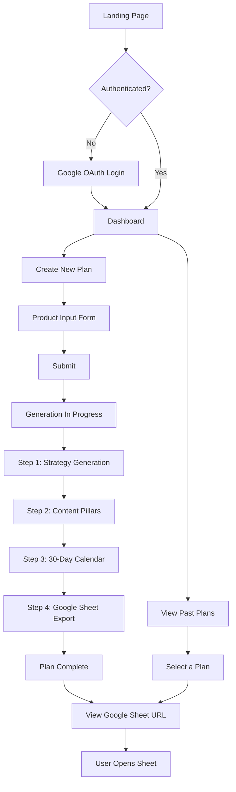
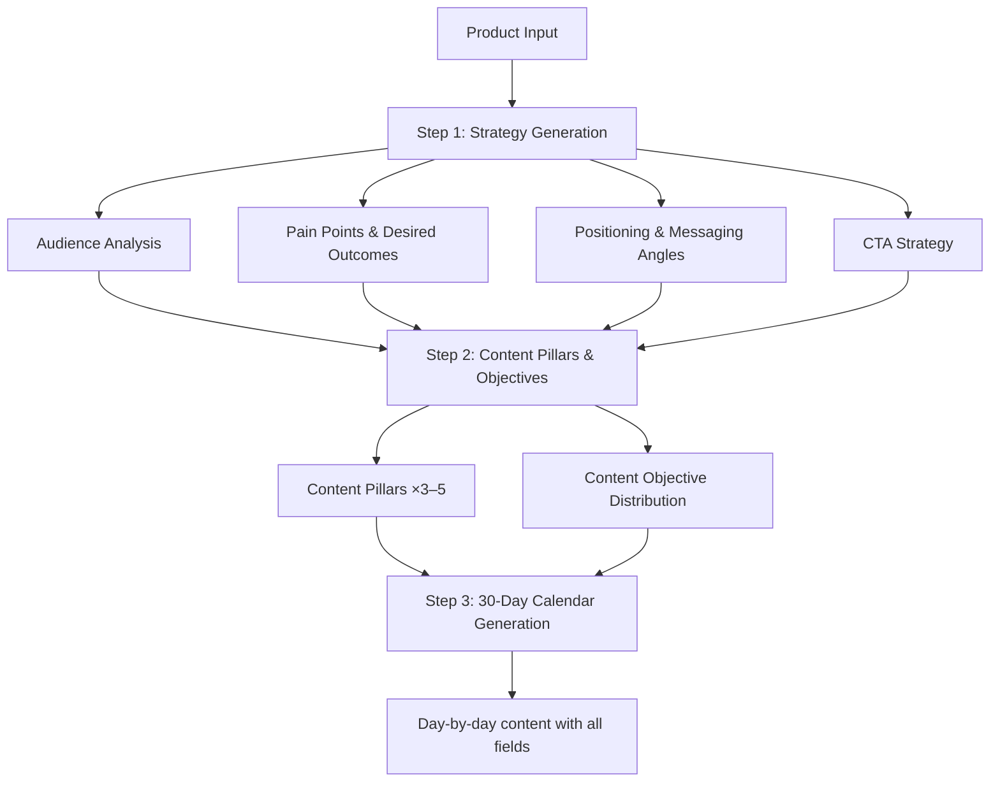
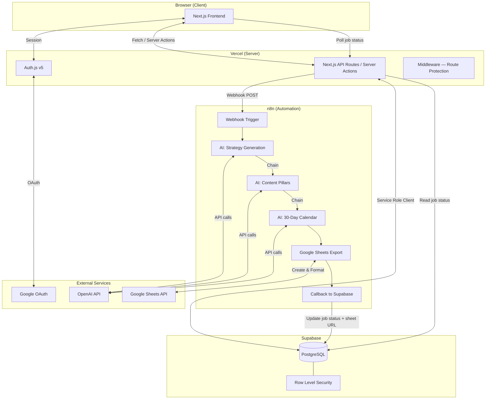
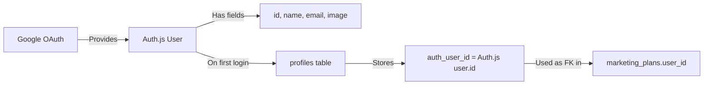
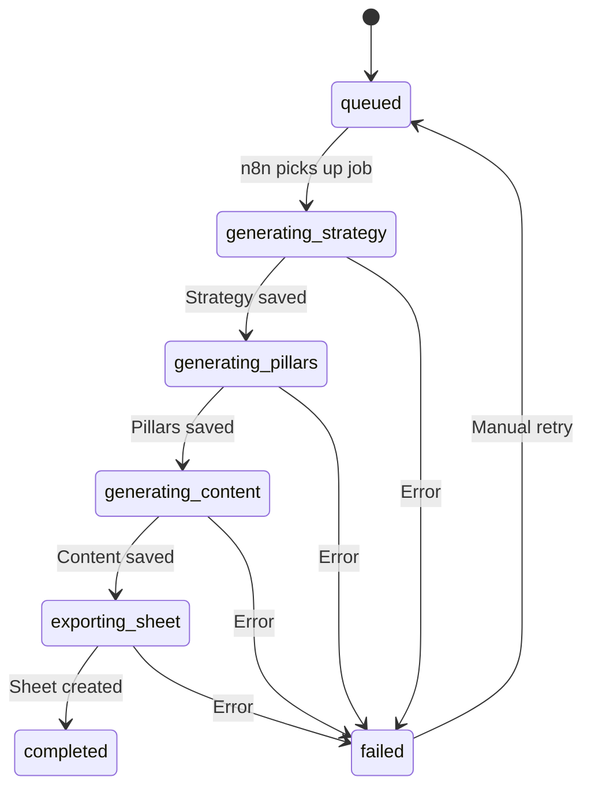

# AI MARKETING PLANNER — PROJECT PLAN

> **Version:** 1.0  
> **Date:** 2026-08-25  
> **Status:** Draft — Awaiting Review

---

## Table of Contents

1. [Product Overview](#1-product-overview)
2. [Core Value Proposition](#2-core-value-proposition)
3. [MVP Scope & Non-Goals](#3-mvp-scope--non-goals)
4. [User Flow](#4-user-flow)
5. [Product Input Form Design](#5-product-input-form-design)
6. [Marketing Strategy Engine](#6-marketing-strategy-engine)
7. [Content Model](#7-content-model)
8. [Google Sheets Output](#8-google-sheets-output)
9. [Tech Stack](#9-tech-stack)
10. [System Architecture](#10-system-architecture)
11. [Authentication Architecture](#11-authentication-architecture)
12. [Database Design](#12-database-design)
13. [Database ERD](#13-database-erd)
14. [Database Relationships](#14-database-relationships)
15. [API Design](#15-api-design)
16. [AI Generation Pipeline](#16-ai-generation-pipeline)
17. [n8n Workflow Design](#17-n8n-workflow-design)
18. [Google Sheets Integration](#18-google-sheets-integration)
19. [Security Architecture](#19-security-architecture)
20. [Error Handling & Resilience](#20-error-handling--resilience)
21. [Environment Variables](#21-environment-variables)
22. [Risk Register](#22-risk-register)
23. [Implementation Phases](#23-implementation-phases)
24. [Critical Review & Improvements](#24-critical-review--improvements)

---

## 1. Product Overview

**AI Marketing Planner** is a SaaS platform that transforms a product/business description into a complete, strategically-grounded 30-day marketing content plan for Instagram.

### The Problem

Business owners, creators, and small-business marketers often have a product but lack the marketing expertise to know:

- What content to create and when to publish it
- Which angles, formats, and messaging strategies to use
- What captions, design copy, and visual direction to follow
- How to balance content objectives across a month

### The Solution

The user provides structured information about their product. The system generates:

1. A marketing strategy (audience, positioning, pain points, content pillars)
2. A 30-day content calendar with per-day captions, design copy, format, and creative direction
3. A professionally formatted Google Sheet ready for handoff to a designer or social media manager

### Target Users

- Small business owners
- Solo creators / influencers
- Marketing freelancers
- Startup founders without a marketing team

---

## 2. Core Value Proposition

> **"Give us your product. Get a complete month of marketing content."**

The user does not need marketing expertise. The system handles strategic thinking. The user provides context; the AI creates the plan.

---

## 3. MVP Scope & Non-Goals

### In Scope (MVP)

| Feature | Notes |
|---|---|
| Google OAuth login | Single auth provider for speed |
| Product input form | Structured form with smart defaults |
| AI-powered strategy generation | Audience, positioning, pillars, objectives |
| 30-day content calendar | Day-by-day with caption, design copy, format, direction |
| Google Sheets export | Professional, formatted output |
| Generation progress UI | Real-time status updates |
| Plan history dashboard | View past generated plans |

### Out of Scope (NOT in MVP)

| Feature | Rationale |
|---|---|
| Instagram / Meta / X / LinkedIn / TikTok publishing | Adds massive complexity; MVP validates plan quality only |
| Multi-platform strategies | MVP targets Instagram exclusively |
| Content image generation | Out of scope; design reference text is sufficient |
| Team collaboration | Single-user initially |
| Plan editing in-app | Users edit in Google Sheets |
| Subscription / payments | Validate product-market fit first |
| Email marketing integration | Unnecessary for MVP validation |
| Analytics / performance tracking | No publishing = no analytics |
| Multi-language UI | Build in English; AI output supports any language based on user input |

---

## 4. User Flow



### Key UX Decisions

- **No onboarding wizard** — the form IS the onboarding
- **Progress indicator** — generation takes 30–90 seconds; show each step
- **No in-app preview** — the Google Sheet IS the deliverable (avoids building a complex content viewer for MVP)
- **Dashboard is simple** — list of past plans with status, date, and sheet link

---

## 5. Product Input Form Design

### Included Fields (9 fields)

Every field below was selected because it directly impacts the quality of the generated strategy. Fields that don't materially change the AI output were removed.

| # | Field | Type | Required | Why Included |
|---|---|---|---|---|
| 1 | **Product Name** | text | ✅ | Needed for captions and sheet labeling |
| 2 | **Product Description** | textarea | ✅ | The core input; this is what the AI reasons about |
| 3 | **Product Category** | select | ✅ | Helps the AI anchor tone and audience assumptions; avoids hallucination |
| 4 | **Target Audience** | textarea | ✅ | Critical for pain points, messaging, and content angles |
| 5 | **Problem It Solves** | textarea | ✅ | Drives pain-point content, objection handling, and conversion copy |
| 6 | **Marketing Objective** | select | ✅ | Dramatically changes content distribution (launch ≠ brand building) |
| 7 | **Brand Tone** | multi-select | ✅ | Controls caption voice and design copy register; max 3 selections |
| 8 | **Website / Product URL** | url | ❌ | Used in CTAs; optional because not all products have a URL yet |
| 9 | **Additional Context** | textarea | ❌ | Catch-all for anything the user wants the AI to know |

### Excluded Fields & Rationale

| Field | Why Excluded |
|---|---|
| Product Price | Rarely changes content strategy meaningfully; adds friction |
| Product Benefits | Overlaps with "Product Description" and "Problem It Solves" |
| Brand Personality | Too similar to Brand Tone; merging avoids user confusion |
| Main CTA | The AI should generate CTAs based on the marketing objective |

### Product Categories (select options)

- E-commerce / Physical Product
- Digital Product / Course
- SaaS / Software
- Service / Agency
- Food & Beverage
- Fashion & Beauty
- Health & Fitness
- Education
- Real Estate
- Personal Brand
- Other

### Marketing Objectives (select options)

- Brand Awareness
- Audience Engagement
- Lead Generation
- Direct Sales
- Product Launch
- Brand Building

### Brand Tone (multi-select, max 3)

- Professional
- Friendly
- Bold
- Premium
- Educational
- Youthful
- Casual
- Luxury
- Direct

---

## 6. Marketing Strategy Engine

### Pipeline Architecture

The AI generation is NOT a single prompt. It is a **chained pipeline** where each step feeds the next. This produces strategically coherent output rather than 30 random posts.



### Step 1: Strategy Generation (single LLM call)

**Input:** All product form fields  
**Output (structured JSON):**

```json
{
  "target_audience_analysis": "...",
  "pain_points": ["..."],
  "desired_outcomes": ["..."],
  "positioning": "...",
  "messaging_angles": ["..."],
  "cta_strategy": "..."
}
```

### Step 2: Content Pillars & Objective Distribution (single LLM call)

**Input:** Strategy from Step 1 + original product input  
**Output (structured JSON):**

```json
{
  "content_pillars": [
    { "name": "...", "description": "...", "percentage": 25 }
  ],
  "objective_distribution": {
    "awareness": 20,
    "education": 20,
    "engagement": 15,
    "trust": 15,
    "social_proof": 10,
    "objection_handling": 10,
    "conversion": 10
  }
}
```

> **Critical:** The objective distribution is NOT hardcoded. The AI adapts it based on the marketing objective. A "Product Launch" plan will weight conversion and awareness higher. A "Brand Building" plan will weight trust and engagement higher.

### Step 3: 30-Day Calendar (single LLM call, or batched 2×15 if token limits are hit)

**Input:** Strategy + Pillars + Objective Distribution + Product Input  
**Output:** Array of 30 content items (see Content Model below)

### Why 3 Calls, Not 1 or 30

| Approach | Problem |
|---|---|
| 1 mega-prompt | Loses strategic coherence; output is unfocused |
| 30 individual calls | Expensive, slow, no strategic thread across days |
| 3 chained calls | Each step builds on the last; strategically coherent + fast enough |

---

## 7. Content Model

### Content Item Schema

Each of the 30 generated content items contains:

| Field | Type | Source | Why Included |
|---|---|---|---|
| `day_number` | integer (1–30) | AI-generated | Ordering |
| `caption` | text | AI-generated | The Instagram caption text |
| `design_copy` | JSON | AI-generated | Structured: headline, subtext, CTA for the visual |
| `post_type` | enum | AI-generated | Reel / Carousel / Static Post / Story |
| `design_reference` | text | AI-generated | Actionable creative direction for the designer |
| `content_objective` | enum | AI-generated | Awareness / Education / Engagement / Trust / Social Proof / Objection Handling / Conversion |
| `content_pillar` | text | AI-generated | Which pillar this post serves |
| `cta` | text | AI-generated | The call-to-action for this specific post |

### Design Copy Structure

Design copy is stored as structured JSON, not a paragraph:

```json
{
  "headline": "مش لازم تكون خبير AI.",
  "subtext": "بس لازم تعرف كيف تستخدمه.",
  "cta": "ابدأ الآن."
}
```

**Rationale:** Designers need discrete text elements, not prose. This structure maps directly to design layers.

### Format vs. Objective (kept strictly separate)

| Concept | Values | Purpose |
|---|---|---|
| **Post Type** (format) | Reel, Carousel, Static Post, Story | HOW the content is delivered |
| **Content Objective** | Awareness, Education, Engagement, Trust, Social Proof, Objection Handling, Conversion | WHY the content exists |

A Carousel can be Educational. A Reel can be for Conversion. These are orthogonal.

### Design Reference Quality Standard

❌ **Bad:** "Beautiful Instagram design."  
✅ **Good:** "Close-up product shot on dark background, high-contrast typography, minimal editorial composition."  
✅ **Good:** "University student using the product at night, laptop visible, cinematic lighting, relatable composition."

The design reference must specify: **Subject, Composition, Environment, Mood, Visual Approach.**

---

## 8. Google Sheets Output

### Sheet Structure

The exported Google Sheet has **2 sheets (tabs):**

#### Tab 1: "Strategy Overview"

| Section | Content |
|---|---|
| Product Name | From input |
| Marketing Objective | From input |
| Target Audience | AI-generated analysis |
| Pain Points | AI-generated list |
| Positioning | AI-generated |
| Content Pillars | AI-generated with descriptions |
| Objective Distribution | AI-generated percentages |

**Rationale:** The strategy tab gives context to anyone reviewing the calendar. Without it, the 30 posts lack strategic grounding.

#### Tab 2: "30-Day Content Calendar"

| Column | Source | Width |
|---|---|---|
| Day | AI | 50px |
| Date | Calculated (start = generation date + 1) | 100px |
| Post Type | AI | 100px |
| Content Objective | AI | 130px |
| Content Pillar | AI | 130px |
| Caption | AI | 350px |
| Design Copy — Headline | AI | 200px |
| Design Copy — Subtext | AI | 200px |
| Design Copy — CTA | AI | 150px |
| Design Reference | AI | 350px |
| CTA | AI | 150px |

### Formatting Specifications

- **Header row:** Bold, white text, dark background (#1a1a2e), frozen
- **Text wrapping:** Enabled on Caption, Design Copy, and Design Reference columns
- **Alternating row colors:** Subtle (#f8f9fa / white)
- **Post Type column:** Color-coded per type
- **Sheet name:** "{Product Name} — 30-Day Plan"
- **Date format:** "Mon DD" (e.g., "Aug 26")

### Decision: Content Objective and Content Pillar ARE included in the sheet

**Rationale:** These columns provide strategic context that helps the user understand *why* each post exists. Without them, the calendar looks like 30 random posts — which defeats the product's value proposition.

### Decision: CTA IS included as a separate column

**Rationale:** The CTA in Design Copy is the visual CTA for the design. The CTA column is the strategic CTA (e.g., "Visit link in bio", "DM us", "Save this post"). These serve different purposes.

---

## 9. Tech Stack

| Layer | Technology | Version | Rationale |
|---|---|---|---|
| **Framework** | Next.js (App Router) | 16.3.2 | Already initialized; modern RSC + server actions |
| **Language** | JavaScript | ES2022+ | Per requirements; no TypeScript |
| **Styling** | Tailwind CSS | 4.x | Already configured via postcss |
| **Auth** | Auth.js (next-auth) | v5 (beta) | Per requirements; NOT Supabase Auth |
| **Database** | Supabase PostgreSQL | Latest | Managed Postgres with RLS |
| **Automation** | n8n | Self-hosted or cloud | Orchestrates AI pipeline + Google Sheets |
| **AI/LLM** | OpenAI API (GPT-4o) | Latest | Structured output support; cost-effective |
| **Sheets** | Google Sheets API (via n8n) | v4 | n8n has native Google Sheets nodes |
| **Hosting** | Vercel | — | Native Next.js deployment |

### Dependencies to Install

```bash
npm install next-auth@beta @supabase/supabase-js jsonwebtoken
```

---

## 10. System Architecture



### Data Flow Summary

1. **User submits form** → Next.js API route creates `marketing_plan` + `generation_job` in Supabase
2. **API fires webhook** to n8n with plan data + job ID
3. **n8n runs the 3-step AI pipeline**, updating job status in Supabase after each step
4. **n8n creates Google Sheet**, formats it, writes data
5. **n8n updates Supabase** with the sheet URL and marks job as completed
6. **Frontend polls** the job status every 3 seconds and shows progress
7. **On completion**, the UI displays the Google Sheet link

---

## 11. Authentication Architecture

### Auth Provider: Google OAuth (single provider)

**Rationale:** Google OAuth is the simplest, most trusted auth method. It also means the user is already authenticated with Google, which helps when we need Google Sheets access later.

### Auth.js v5 Setup

```
auth.js                         ← Auth config (root)
app/api/auth/[...nextauth]/route.js  ← Route handler
middleware.js                   ← Route protection
```

### Session Strategy: JWT (stateless)

**Rationale:** JWT sessions avoid the need for a session table in Supabase. Auth.js signs the JWT; the server verifies it on every request. This is simpler and faster for MVP.

### Identity Mapping: Auth.js → Supabase

This is the most critical architectural decision.



#### How it works:

1. **Auth.js assigns a unique `user.id`** on first login (a UUID or provider-specific ID)
2. **On first login**, a `signIn` callback or JWT callback upserts a row into `profiles` with `auth_user_id = user.id`
3. **Every API route** calls `const session = await auth()` to get the authenticated user
4. **`session.user.id`** is used to query Supabase: `WHERE user_id = session.user.id`

#### Why NOT use Supabase `auth.uid()`

Supabase's `auth.uid()` only works with Supabase Auth JWTs. Since we use Auth.js, we cannot rely on `auth.uid()`. Instead:

- **Server-side:** We use the Supabase **service role** client (which bypasses RLS) and enforce ownership in our application code by always filtering with `WHERE user_id = ?`
- **RLS is still enabled** as a defense-in-depth measure, but the primary authorization check happens in the API layer

#### Why Service Role + App-Level Auth (not custom JWT → RLS)

| Approach | Pros | Cons |
|---|---|---|
| Custom JWT → Supabase RLS | "Pure" Supabase pattern | Complex JWT signing, JWT expiry management, debugging difficulty |
| Service Role + App-Level Auth | Simple, debuggable, fast to build | Must be disciplined about WHERE clauses |

**Decision: Service Role + App-Level Auth** for MVP. The simplicity and debuggability outweigh the theoretical purity of the JWT approach. Every query that touches user data MUST include a `user_id` filter. This is enforced by a helper function.

```javascript
// lib/supabase-admin.js
import { createClient } from '@supabase/supabase-js';

export const supabaseAdmin = createClient(
  process.env.SUPABASE_URL,
  process.env.SUPABASE_SERVICE_ROLE_KEY
);
```

```javascript
// lib/auth-guard.js
import { auth } from '@/auth';

export async function getAuthenticatedUser() {
  const session = await auth();
  if (!session?.user?.id) {
    throw new Error('Unauthorized');
  }
  return session.user;
}
```

### Protected Routes

| Route | Protection |
|---|---|
| `/` | Public (landing page) |
| `/login` | Public |
| `/dashboard` | Protected (middleware redirect) |
| `/plans/new` | Protected |
| `/plans/[id]` | Protected + ownership check |
| `/api/plans/*` | Protected (auth guard in handler) |
| `/api/webhooks/n8n` | Protected by shared secret (no user session) |

### Middleware Configuration

```javascript
// middleware.js
export { auth as middleware } from '@/auth';

export const config = {
  matcher: ['/dashboard/:path*', '/plans/:path*'],
};
```

---

## 12. Database Design

### Design Principles

- **Minimum viable schema** — no tables without a clear purpose
- **Normalize where it aids querying** — denormalize where it aids simplicity
- **Every table has** `id`, `created_at`, `updated_at`
- **Every user-owned table has** `user_id` for ownership
- **UUIDs everywhere** — no auto-increment integers for primary keys

---

### Table: `profiles`

**Purpose:** Maps Auth.js user identity to application data. Source of truth for user ownership.

**Why it exists:** Auth.js manages authentication but doesn't store application-level user data. This table bridges that gap.

| Column | Type | Nullable | Default | Constraints | Source |
|---|---|---|---|---|---|
| `id` | `uuid` | NOT NULL | `gen_random_uuid()` | PRIMARY KEY | System |
| `auth_user_id` | `text` | NOT NULL | — | UNIQUE | Auth.js (`user.id`) |
| `email` | `text` | NOT NULL | — | UNIQUE | Auth.js |
| `name` | `text` | NULL | — | — | Auth.js |
| `avatar_url` | `text` | NULL | — | — | Auth.js |
| `created_at` | `timestamptz` | NOT NULL | `now()` | — | System |
| `updated_at` | `timestamptz` | NOT NULL | `now()` | — | System |

**Indexes:**
- `idx_profiles_auth_user_id` on `auth_user_id` (unique, used in every auth lookup)

**RLS Policy (defense-in-depth):**
- SELECT: `auth_user_id = current_setting('app.current_user_id')` (set via `SET LOCAL` before queries, or bypassed with service role)

**Decision: `auth_user_id` is `text`, not `uuid`**

Auth.js provider IDs may not be valid UUIDs (e.g., Google returns a numeric string). Using `text` avoids cast errors.

**Decision: `user_id` in other tables references `profiles.auth_user_id`, not `profiles.id`**

This avoids an extra JOIN in every query. When we have `session.user.id`, we can directly query `WHERE user_id = session.user.id` without first looking up the `profiles.id`.

---

### Table: `marketing_plans`

**Purpose:** Stores the product input and the generated strategy for one marketing plan.

**Why it exists:** This is the core entity. One user can have many plans.

| Column | Type | Nullable | Default | Constraints | Source |
|---|---|---|---|---|---|
| `id` | `uuid` | NOT NULL | `gen_random_uuid()` | PRIMARY KEY | System |
| `user_id` | `text` | NOT NULL | — | FK → `profiles.auth_user_id` | System |
| `product_name` | `text` | NOT NULL | — | — | User |
| `product_description` | `text` | NOT NULL | — | — | User |
| `product_category` | `text` | NOT NULL | — | — | User |
| `target_audience` | `text` | NOT NULL | — | — | User |
| `problem_solved` | `text` | NOT NULL | — | — | User |
| `marketing_objective` | `text` | NOT NULL | — | CHECK (valid enum) | User |
| `brand_tone` | `text[]` | NOT NULL | — | — | User |
| `website_url` | `text` | NULL | — | — | User |
| `additional_context` | `text` | NULL | — | — | User |
| `strategy` | `jsonb` | NULL | — | — | AI |
| `content_pillars` | `jsonb` | NULL | — | — | AI |
| `objective_distribution` | `jsonb` | NULL | — | — | AI |
| `status` | `text` | NOT NULL | `'draft'` | CHECK (`status` IN ('draft', 'generating', 'completed', 'failed')) | System |
| `created_at` | `timestamptz` | NOT NULL | `now()` | — | System |
| `updated_at` | `timestamptz` | NOT NULL | `now()` | — | System |

**Indexes:**
- `idx_marketing_plans_user_id` on `user_id`
- `idx_marketing_plans_status` on `status`

**CHECK constraints:**
- `marketing_objective` IN ('brand_awareness', 'audience_engagement', 'lead_generation', 'direct_sales', 'product_launch', 'brand_building')
- `status` IN ('draft', 'generating', 'completed', 'failed')

#### Decision: Strategy, Content Pillars, and Objective Distribution as JSONB columns (not separate tables)

**Rationale:**

| Approach | Pros | Cons |
|---|---|---|
| Separate `content_pillars` table | Normalized; queryable by pillar | Extra table, extra JOINs, extra complexity for data that is always read as a set |
| JSONB column on `marketing_plans` | Simple; read/write as a unit; no JOINs | Can't query individual pillars with SQL (don't need to in MVP) |

Content pillars are:
- Generated as a set (not individually)
- Always read as a set (never queried individually)
- Never updated independently
- Only 3–5 items per plan
- Referenced by name in content items (string match)

**Therefore: JSONB is the correct choice for MVP.** A separate table adds complexity without benefit.

Similarly, `strategy` and `objective_distribution` are read-only AI outputs that are always consumed as a whole. JSONB is appropriate.

#### Decision: `brand_tone` as `text[]` (PostgreSQL array)

The user selects 1–3 tone values from a fixed list. A Postgres text array is simpler than a junction table for this fixed, small-cardinality field.

---

### Table: `content_items`

**Purpose:** Stores individual generated content pieces (one row per day in the 30-day plan).

**Why it exists:** Content items need to be individually addressable for Google Sheets export and potential future editing.

| Column | Type | Nullable | Default | Constraints | Source |
|---|---|---|---|---|---|
| `id` | `uuid` | NOT NULL | `gen_random_uuid()` | PRIMARY KEY | System |
| `marketing_plan_id` | `uuid` | NOT NULL | — | FK → `marketing_plans.id` | System |
| `user_id` | `text` | NOT NULL | — | FK → `profiles.auth_user_id` | System (denormalized) |
| `day_number` | `integer` | NOT NULL | — | CHECK (1–30) | AI |
| `caption` | `text` | NOT NULL | — | — | AI |
| `design_copy` | `jsonb` | NOT NULL | — | — | AI |
| `post_type` | `text` | NOT NULL | — | CHECK (valid enum) | AI |
| `content_objective` | `text` | NOT NULL | — | CHECK (valid enum) | AI |
| `content_pillar` | `text` | NOT NULL | — | — | AI |
| `design_reference` | `text` | NOT NULL | — | — | AI |
| `cta` | `text` | NOT NULL | — | — | AI |
| `created_at` | `timestamptz` | NOT NULL | `now()` | — | System |
| `updated_at` | `timestamptz` | NOT NULL | `now()` | — | System |

**Indexes:**
- `idx_content_items_plan_id` on `marketing_plan_id`
- `idx_content_items_user_id` on `user_id`
- UNIQUE (`marketing_plan_id`, `day_number`) — no duplicate days per plan

**CHECK constraints:**
- `post_type` IN ('reel', 'carousel', 'static_post', 'story')
- `content_objective` IN ('awareness', 'education', 'engagement', 'trust', 'social_proof', 'objection_handling', 'conversion')
- `day_number` BETWEEN 1 AND 30

#### Decision: `user_id` is denormalized onto `content_items`

This avoids a JOIN through `marketing_plans` when we need to verify ownership. The cost is a small amount of redundant data (30 rows × 1 text field). The benefit is simpler, faster auth checks.

#### Decision: `design_copy` as JSONB

Design copy has a structured format (headline, subtext, CTA) that maps naturally to JSON. Flattening it into 3 separate text columns would work but loses the semantic grouping. JSONB is appropriate here.

---

### Table: `generation_jobs`

**Purpose:** Tracks the async generation pipeline status.

**Why it exists:** Generation takes 30–90 seconds across 3 AI calls + 1 Sheets export. The frontend needs to poll for progress. Without this table, we'd have no way to communicate progress or detect failures.

| Column | Type | Nullable | Default | Constraints | Source |
|---|---|---|---|---|---|
| `id` | `uuid` | NOT NULL | `gen_random_uuid()` | PRIMARY KEY | System |
| `user_id` | `text` | NOT NULL | — | FK → `profiles.auth_user_id` | System |
| `marketing_plan_id` | `uuid` | NOT NULL | — | FK → `marketing_plans.id`, UNIQUE | System |
| `status` | `text` | NOT NULL | `'queued'` | CHECK (valid enum) | System |
| `current_step` | `text` | NULL | — | — | n8n |
| `error_message` | `text` | NULL | — | — | n8n |
| `started_at` | `timestamptz` | NULL | — | — | System |
| `completed_at` | `timestamptz` | NULL | — | — | System |
| `created_at` | `timestamptz` | NOT NULL | `now()` | — | System |
| `updated_at` | `timestamptz` | NOT NULL | `now()` | — | System |

**Indexes:**
- `idx_generation_jobs_plan_id` on `marketing_plan_id` (unique)
- `idx_generation_jobs_user_id` on `user_id`
- `idx_generation_jobs_status` on `status`

**CHECK constraints:**
- `status` IN ('queued', 'generating_strategy', 'generating_pillars', 'generating_content', 'exporting_sheet', 'completed', 'failed')

**State Machine:**



#### Decision: `current_step` as human-readable text

`current_step` stores a display-friendly message like "Generating strategy..." or "Creating Google Sheet...". This avoids the frontend needing to map enum values to display strings.

#### Decision: UNIQUE constraint on `marketing_plan_id`

One plan has exactly one generation job. If we need to retry, we update the existing job row rather than creating a new one. This prevents orphaned job records.

---

### Table: `google_sheet_exports`

**Purpose:** Tracks the Google Sheet created for a plan.

**Why it exists:** We need to store the sheet URL for the user, detect if a plan has already been exported, and handle export failures independently of generation failures.

| Column | Type | Nullable | Default | Constraints | Source |
|---|---|---|---|---|---|
| `id` | `uuid` | NOT NULL | `gen_random_uuid()` | PRIMARY KEY | System |
| `marketing_plan_id` | `uuid` | NOT NULL | — | FK → `marketing_plans.id`, UNIQUE | System |
| `user_id` | `text` | NOT NULL | — | FK → `profiles.auth_user_id` | System |
| `spreadsheet_id` | `text` | NULL | — | — | Google API |
| `spreadsheet_url` | `text` | NULL | — | — | Google API |
| `status` | `text` | NOT NULL | `'pending'` | CHECK (valid enum) | System |
| `error_message` | `text` | NULL | — | — | n8n |
| `created_at` | `timestamptz` | NOT NULL | `now()` | — | System |
| `updated_at` | `timestamptz` | NOT NULL | `now()` | — | System |

**Indexes:**
- `idx_sheet_exports_plan_id` on `marketing_plan_id` (unique)
- `idx_sheet_exports_user_id` on `user_id`

**CHECK constraints:**
- `status` IN ('pending', 'creating', 'completed', 'failed')

#### Decision: Separate table (not a column on `marketing_plans`)

A sheet export can fail independently of content generation. Having a separate table allows:
- Clean retry logic for sheet creation only
- Clear status tracking for the export step
- Future support for re-exporting (regenerate sheet without regenerating content)

---

### Why NO separate `content_pillars` table

Content pillars are:
- 3–5 items per plan (tiny cardinality)
- Generated as a batch (never individually)
- Referenced by name string in `content_items.content_pillar`
- Never queried as standalone entities
- Never shared across plans

A separate table would require:
- FK from `content_items` → `content_pillars` (adds a JOIN)
- Insertions in the correct order (pillars before items)
- Cascade delete management

**The JSONB column on `marketing_plans.content_pillars` is sufficient and simpler.**

---

## 13. Database ERD

```mermaid
erDiagram
    profiles {
        uuid id PK
        text auth_user_id UK
        text email UK
        text name
        text avatar_url
        timestamptz created_at
        timestamptz updated_at
    }

    marketing_plans {
        uuid id PK
        text user_id FK
        text product_name
        text product_description
        text product_category
        text target_audience
        text problem_solved
        text marketing_objective
        text_arr brand_tone
        text website_url
        text additional_context
        jsonb strategy
        jsonb content_pillars
        jsonb objective_distribution
        text status
        timestamptz created_at
        timestamptz updated_at
    }

    content_items {
        uuid id PK
        uuid marketing_plan_id FK
        text user_id FK
        integer day_number
        text caption
        jsonb design_copy
        text post_type
        text content_objective
        text content_pillar
        text design_reference
        text cta
        timestamptz created_at
        timestamptz updated_at
    }

    generation_jobs {
        uuid id PK
        text user_id FK
        uuid marketing_plan_id FK_UK
        text status
        text current_step
        text error_message
        timestamptz started_at
        timestamptz completed_at
        timestamptz created_at
        timestamptz updated_at
    }

    google_sheet_exports {
        uuid id PK
        uuid marketing_plan_id FK_UK
        text user_id FK
        text spreadsheet_id
        text spreadsheet_url
        text status
        text error_message
        timestamptz created_at
        timestamptz updated_at
    }

    profiles ||--o{ marketing_plans : "owns"
    profiles ||--o{ generation_jobs : "owns"
    profiles ||--o{ google_sheet_exports : "owns"
    profiles ||--o{ content_items : "owns"
    marketing_plans ||--o{ content_items : "contains"
    marketing_plans ||--o| generation_jobs : "has"
    marketing_plans ||--o| google_sheet_exports : "produces"
```

---

## 14. Database Relationships

| Parent | Child | FK Column | Relationship | On Delete | Rationale |
|---|---|---|---|---|---|
| `profiles` | `marketing_plans` | `marketing_plans.user_id` → `profiles.auth_user_id` | One-to-Many | CASCADE | Deleting a user deletes all their plans |
| `marketing_plans` | `content_items` | `content_items.marketing_plan_id` → `marketing_plans.id` | One-to-Many | CASCADE | Deleting a plan deletes its content |
| `profiles` | `content_items` | `content_items.user_id` → `profiles.auth_user_id` | One-to-Many | CASCADE | Denormalized ownership; cascades with user |
| `marketing_plans` | `generation_jobs` | `generation_jobs.marketing_plan_id` → `marketing_plans.id` | One-to-One | CASCADE | Job is part of the plan lifecycle |
| `profiles` | `generation_jobs` | `generation_jobs.user_id` → `profiles.auth_user_id` | One-to-Many | CASCADE | Ownership |
| `marketing_plans` | `google_sheet_exports` | `google_sheet_exports.marketing_plan_id` → `marketing_plans.id` | One-to-One | CASCADE | Sheet export is part of the plan lifecycle |
| `profiles` | `google_sheet_exports` | `google_sheet_exports.user_id` → `profiles.auth_user_id` | One-to-Many | CASCADE | Ownership |

**Why CASCADE everywhere:** In the MVP, if a user is deleted, everything they created should be deleted. If a plan is deleted, all its dependent data should go. There is no scenario in the MVP where orphaned generation jobs or content items are useful.

---

## 15. API Design

### Next.js API Routes / Server Actions

| Endpoint | Method | Auth | Purpose |
|---|---|---|---|
| `POST /api/plans` | POST | Session | Create a new marketing plan + trigger generation |
| `GET /api/plans` | GET | Session | List user's plans |
| `GET /api/plans/[id]` | GET | Session + Ownership | Get plan details |
| `GET /api/plans/[id]/status` | GET | Session + Ownership | Poll generation status |
| `POST /api/plans/[id]/retry` | POST | Session + Ownership | Retry failed generation |
| `POST /api/webhooks/n8n` | POST | Shared Secret | n8n callback to update job status |

### Webhook Security

The n8n → Next.js callback webhook is authenticated with a shared secret:

```
Authorization: Bearer <N8N_WEBHOOK_SECRET>
```

This is NOT a user session. It's a server-to-server credential.

### API Response Patterns

```javascript
// Success
{ success: true, data: { ... } }

// Error
{ success: false, error: { code: 'UNAUTHORIZED', message: '...' } }
```

---

## 16. AI Generation Pipeline

### LLM Selection

**Primary: OpenAI GPT-4o**

| Criteria | GPT-4o |
|---|---|
| Structured JSON output | ✅ Native `response_format` with `strict: true` |
| Multilingual captions | ✅ Strong Arabic/English support |
| Cost per plan (~3 calls) | ~$0.03–0.08 (input + output tokens) |
| Speed | ~10–30s per call |
| Quality | High for marketing copy |

### Prompt Design Principles

1. **System prompt** defines the AI's role as a marketing strategist
2. **User prompt** contains the structured product input
3. **Response format** enforces a JSON schema — no free-form parsing
4. **Each call gets the previous call's output** as additional context

### Token Budget Estimation

| Step | Input Tokens (est.) | Output Tokens (est.) | Cost (GPT-4o) |
|---|---|---|---|
| Strategy | ~800 | ~600 | ~$0.01 |
| Pillars | ~1,400 | ~400 | ~$0.01 |
| 30-Day Calendar | ~2,000 | ~6,000 | ~$0.04 |
| **Total** | **~4,200** | **~7,000** | **~$0.06** |

At $0.06/plan, cost is negligible for MVP validation.

### Fallback Strategy

If a single LLM call fails:
1. Retry once with exponential backoff
2. If retry fails, mark job as `failed` with error message
3. User can retry from the dashboard

No automatic model fallback in MVP (adds complexity without clear benefit at this scale).

---

## 17. n8n Workflow Design

### Why n8n (not direct API calls from Next.js)

| Concern | Direct API calls | n8n |
|---|---|---|
| Long-running process | Vercel functions timeout (10–60s) | n8n has no timeout |
| Chained AI calls | Must manage state in code | Visual workflow |
| Google Sheets formatting | Must code Sheets API directly | Native Sheets nodes |
| Retry logic | Must build from scratch | Built-in retry |
| Monitoring | Must build logging | Built-in execution history |
| Error recovery | Must build | Built-in error handling |

### Workflow: Generate Marketing Plan

```
Webhook Trigger (receives plan data + job ID)
  ↓
Update Job Status → "generating_strategy"
  ↓
OpenAI: Generate Strategy (structured JSON)
  ↓
Save Strategy to Supabase (marketing_plans.strategy)
  ↓
Update Job Status → "generating_pillars"
  ↓
OpenAI: Generate Content Pillars (structured JSON)
  ↓
Save Pillars to Supabase (marketing_plans.content_pillars + objective_distribution)
  ↓
Update Job Status → "generating_content"
  ↓
OpenAI: Generate 30-Day Calendar (structured JSON)
  ↓
Save Content Items to Supabase (bulk insert into content_items)
  ↓
Update Job Status → "exporting_sheet"
  ↓
Google Sheets: Create Spreadsheet
  ↓
Google Sheets: Add "Strategy Overview" tab
  ↓
Google Sheets: Add "30-Day Content Calendar" tab
  ↓
Google Sheets: Format headers, widths, wrapping, colors
  ↓
Save Export to Supabase (google_sheet_exports)
  ↓
Update Job Status → "completed"
  ↓
Update Marketing Plan Status → "completed"
```

### n8n → Supabase Communication

n8n uses the Supabase **REST API** (PostgREST) with the **service role key** to update records directly. This is simpler than calling back to our Next.js API.

### n8n Error Handling

Each step has an error branch that:
1. Updates `generation_jobs.status` to `'failed'`
2. Updates `generation_jobs.error_message` with the error detail
3. Updates `marketing_plans.status` to `'failed'`

---

## 18. Google Sheets Integration

### Authentication: Google Service Account

A Google Service Account is used (not user OAuth) because:
- The sheet is created by the **system**, not the user
- No need for the user to grant Google Sheets permissions
- The sheet is shared with the user's email (from `profiles.email`)

### Sheet Creation Flow

1. **Create spreadsheet** via Sheets API (n8n Google Sheets node)
2. **Rename default sheet** to "Strategy Overview"
3. **Write strategy data** to "Strategy Overview"
4. **Create second sheet** "30-Day Content Calendar"
5. **Write content data** to calendar sheet
6. **Apply formatting** via `batchUpdate` (HTTP Request node in n8n)
7. **Share sheet** with the user's email (Google Drive API — viewer or editor)
8. **Return** `spreadsheet_id` and `spreadsheet_url`

### Sharing Strategy

The sheet is shared with the user's Google email (the same one they used to log in). The user receives it in their Google Drive "Shared with me."

**Alternative considered:** Creating the sheet in the user's Drive via their OAuth token. Rejected because it requires Google Drive OAuth scope, which is a much heavier auth flow for MVP.

---

## 19. Security Architecture

### Authentication

- Auth.js v5 with Google OAuth
- JWT session strategy (signed, httpOnly)
- CSRF protection built into Auth.js

### Authorization

- Every API route checks `session.user.id`
- Every database query includes `WHERE user_id = session.user.id`
- Ownership checks via a shared `getAuthenticatedUser()` helper

### Supabase Access

- **Service role key** used server-side only (never exposed to client)
- **Anon key** not used (all DB access goes through server-side API routes)
- RLS enabled as defense-in-depth (but not the primary auth mechanism)

### Webhook Security

- n8n → Next.js: Shared secret in `Authorization` header
- Next.js → n8n: Shared secret in `Authorization` header

### Environment Variables

All secrets stored in environment variables, never committed to git.

### Input Validation

- Server-side validation on all form inputs (length, format, allowed values)
- SQL injection prevented by Supabase client (parameterized queries)
- XSS prevented by React's default escaping

---

## 20. Error Handling & Resilience

### AI Generation Failures

| Failure | Handling |
|---|---|
| LLM API timeout | Retry once; then mark failed |
| Invalid JSON from LLM | Retry once with stricter prompt; then mark failed |
| LLM rate limit | Retry with exponential backoff (n8n built-in) |
| LLM content filter | Mark failed with descriptive error |

### Google Sheets Failures

| Failure | Handling |
|---|---|
| Sheets API rate limit | Retry with backoff |
| Invalid service account | Mark failed; admin alert |
| Sharing failure | Mark sheet export failed; sheet still exists |

### Network Failures

| Failure | Handling |
|---|---|
| n8n unreachable | Job stays in `queued`; user sees "Processing..." |
| Supabase unreachable (from n8n) | n8n retry; then fail |
| Polling fails (client-side) | Retry polling; show "Reconnecting..." |

### User-Facing Error Messages

| Internal Error | User Message |
|---|---|
| LLM failure | "We couldn't generate your plan. Please try again." |
| Sheets failure | "Your plan was generated but we couldn't create the Google Sheet. Click retry." |
| Unknown error | "Something went wrong. Please try again or contact support." |

---

## 21. Environment Variables

| Variable | Where Used | Purpose |
|---|---|---|
| `AUTH_SECRET` | Auth.js | JWT signing secret |
| `AUTH_GOOGLE_ID` | Auth.js | Google OAuth Client ID |
| `AUTH_GOOGLE_SECRET` | Auth.js | Google OAuth Client Secret |
| `SUPABASE_URL` | Next.js server | Supabase project URL |
| `SUPABASE_SERVICE_ROLE_KEY` | Next.js server | Supabase admin access |
| `N8N_WEBHOOK_URL` | Next.js server | n8n trigger endpoint |
| `N8N_WEBHOOK_SECRET` | Next.js server + n8n | Shared secret for webhook auth |
| `NEXT_PUBLIC_APP_URL` | Next.js | App base URL (for OAuth redirect) |

**n8n environment (configured in n8n):**

| Variable | Purpose |
|---|---|
| `OPENAI_API_KEY` | LLM access |
| `SUPABASE_URL` | Database access from n8n |
| `SUPABASE_SERVICE_ROLE_KEY` | Database admin access from n8n |
| `GOOGLE_SERVICE_ACCOUNT_JSON` | Google Sheets API auth |
| `N8N_WEBHOOK_SECRET` | Verify callbacks to Next.js |

---

## 22. Risk Register

| # | Risk | Impact | Likelihood | Mitigation |
|---|---|---|---|---|
| 1 | AI output quality is too generic | High — destroys value prop | Medium | Rigorous prompt engineering; structured output; human review of first 20 plans |
| 2 | AI generates culturally inappropriate content | High — brand damage | Low | System prompt guardrails; content filter checks |
| 3 | Google Sheets formatting is fragile | Medium — unprofessional output | Medium | Comprehensive formatting in `batchUpdate`; test with various data lengths |
| 4 | n8n becomes a single point of failure | High — no plans generated | Low | n8n health monitoring; manual retry capability |
| 5 | Auth.js ↔ Supabase identity mapping breaks | High — data access issues | Low | Thorough testing of upsert logic; unique constraints |
| 6 | LLM costs spike with many users | Medium — budget risk | Low (MVP scale) | Monitor usage; set OpenAI spend alerts; consider caching common strategies |
| 7 | Vercel function timeouts on webhook trigger | Low — webhook is fire-and-forget | Low | Ensure webhook call is async; don't await n8n response |
| 8 | User expects instant results | Medium — poor UX | High | Clear progress UI; set expectations ("~1 minute") |
| 9 | Google changes Sheets API | Medium — breaks export | Very Low | Pin API version; monitor deprecation notices |
| 10 | Content in non-Latin scripts breaks Sheet layout | Medium — RTL layout issues | Medium | Test with Arabic content; configure RTL sheet settings |

---

## 23. Implementation Phases

### Phase 1: Foundation (Days 1–2)

- [ ] Set up Auth.js with Google OAuth
- [ ] Create `profiles` table + upsert on login
- [ ] Implement middleware for route protection
- [ ] Build landing page
- [ ] Build dashboard page (empty state)
- [ ] Deploy to Vercel

### Phase 2: Core Form & Data (Days 3–4)

- [ ] Build product input form UI
- [ ] Client-side validation
- [ ] Server-side validation
- [ ] Create `marketing_plans` table
- [ ] Create `content_items` table
- [ ] Create `generation_jobs` table
- [ ] Create `google_sheet_exports` table
- [ ] API route: POST /api/plans (save form + create job)
- [ ] API route: GET /api/plans (list plans)

### Phase 3: AI Pipeline (Days 5–7)

- [ ] Set up n8n workflow
- [ ] Design and test Strategy prompt
- [ ] Design and test Content Pillars prompt
- [ ] Design and test 30-Day Calendar prompt
- [ ] Implement n8n → Supabase status updates
- [ ] Test end-to-end generation pipeline
- [ ] API route: GET /api/plans/[id]/status (polling)

### Phase 4: Google Sheets Export (Days 8–9)

- [ ] Set up Google Service Account
- [ ] n8n: Create spreadsheet node
- [ ] n8n: Write Strategy Overview tab
- [ ] n8n: Write Content Calendar tab
- [ ] n8n: Format headers, widths, colors
- [ ] n8n: Share sheet with user email
- [ ] Save export record to Supabase

### Phase 5: Polish & Error Handling (Days 10–11)

- [ ] Generation progress UI (step-by-step)
- [ ] Error states and retry flow
- [ ] Plan detail page with Google Sheet link
- [ ] Dashboard populated with real data
- [ ] Loading states and transitions
- [ ] Mobile responsiveness

### Phase 6: Testing & Launch (Days 12–14)

- [ ] End-to-end testing (happy path)
- [ ] Error scenario testing
- [ ] RTL / Arabic content testing
- [ ] Performance testing (concurrent generations)
- [ ] Security review (auth, ownership, webhooks)
- [ ] Production deployment
- [ ] Monitor first 10 real user plans

---

## 24. Critical Review & Improvements

After writing this plan, I performed a critical review. Here are the issues identified and how they were resolved:

### Issue 1: Content Pillar referential integrity

**Problem:** `content_items.content_pillar` is a free-text field referencing a name from `marketing_plans.content_pillars` (JSONB). There's no FK constraint, so the AI could generate a pillar name that doesn't match.

**Resolution:** This is acceptable for MVP. The AI generates both the pillars and the content items in a pipeline where the pillar names are passed as input to the calendar prompt. A CHECK constraint is impractical here since the allowed values are dynamic. If this becomes a data quality issue, we can add a validation step in n8n that cross-references pillar names before saving content items.

### Issue 2: Race condition on job status polling

**Problem:** If the frontend polls `/api/plans/[id]/status` at the exact moment n8n is updating the status, could we get stale data?

**Resolution:** Not a real concern. Supabase PostgreSQL guarantees read-after-write consistency within a single connection. n8n writes via PostgREST (one connection); the API reads via PostgREST (another connection). PostgreSQL's MVCC ensures reads see committed writes. The worst case is a 1-poll-cycle delay (3 seconds), which is imperceptible.

### Issue 3: Google Sheet sharing assumes Google email

**Problem:** Auth.js Google OAuth gives us the user's Google email. We share the sheet with that email. But what if the user has multiple Google accounts?

**Resolution:** The sheet is shared with the email they logged in with. This is the correct behavior — they authenticated with that identity. We can add "Copy link" as an alternative if they need to access from another account. For MVP, this is sufficient.

### Issue 4: No rate limiting on plan generation

**Problem:** A user could spam the "Create Plan" button and trigger many expensive AI generation jobs.

**Resolution:** Added to the API layer: before creating a new generation job, check if the user has any jobs in `queued` or `generating_*` status. If so, reject the request with "You already have a plan being generated. Please wait for it to complete."

### Issue 5: No plan deletion capability

**Problem:** The plan specifies creation but not deletion. Users might want to delete old plans.

**Resolution:** Not included in MVP scope. Plans are lightweight (text data). If needed post-launch, it's a simple `DELETE /api/plans/[id]` with CASCADE handling. Adding it now would require building a confirmation UI, handling cascade deletion of Sheets (should we delete the Google Sheet too?), and edge cases around in-progress generation. Defer.

### Issue 6: Service role key on Vercel (security concern)

**Problem:** The Supabase service role key has full admin access and is stored as a Vercel environment variable. If Vercel is compromised, all user data is exposed.

**Resolution:** This is the standard Supabase pattern for server-side access. Mitigations:
1. Service role key is NEVER exposed to the client (server-side only)
2. Vercel encrypts environment variables at rest
3. RLS is enabled as defense-in-depth even though we don't rely on it as the primary auth layer
4. For post-MVP, consider a dedicated API user with limited permissions instead of the service role

### Issue 7: `updated_at` doesn't auto-update

**Problem:** PostgreSQL doesn't auto-update `updated_at` on row changes (unlike some ORMs).

**Resolution:** Add a database trigger:

```sql
CREATE OR REPLACE FUNCTION update_updated_at()
RETURNS TRIGGER AS $$
BEGIN
  NEW.updated_at = now();
  RETURN NEW;
END;
$$ LANGUAGE plpgsql;

-- Apply to each table
CREATE TRIGGER set_updated_at
  BEFORE UPDATE ON profiles
  FOR EACH ROW EXECUTE FUNCTION update_updated_at();

-- Repeat for marketing_plans, content_items, generation_jobs, google_sheet_exports
```

### Issue 8: 30-day calendar may hit token limits

**Problem:** Generating 30 content items in a single LLM call could produce ~6,000+ output tokens. GPT-4o supports up to 16,384 output tokens, so this should fit. But if it doesn't?

**Resolution:** The pipeline design supports a fallback: split into 2 calls of 15 days each. The n8n workflow can detect if output is truncated and make a follow-up call for remaining days. This is a contingency — not the default path.

### Issue 9: No webhook idempotency

**Problem:** If n8n retries a failed step, it might call the status-update endpoint twice, or insert duplicate content items.

**Resolution:** 
- Job status updates are idempotent (setting status to the same value is harmless)
- Content items have a UNIQUE constraint on `(marketing_plan_id, day_number)` — duplicate inserts will fail cleanly
- Sheet export has a UNIQUE constraint on `marketing_plan_id` — duplicate exports are prevented
- n8n can use `UPSERT` (ON CONFLICT) for content items to handle retries gracefully

---

> **This document is the source of truth for the AI Marketing Planner MVP architecture. All implementation decisions should reference this plan. Any deviations must be documented and justified.**
